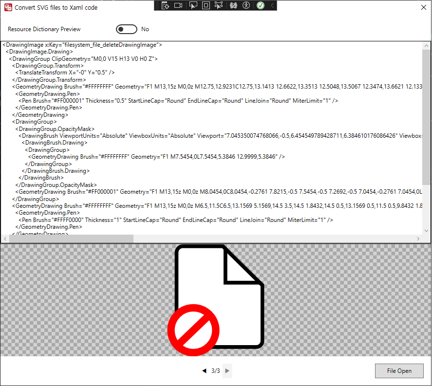
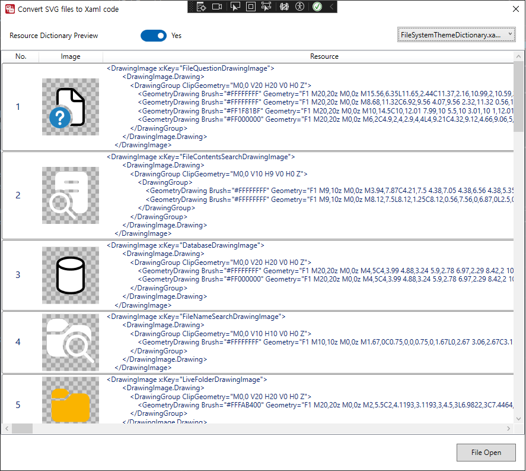

## SVG To Xaml

### SVG To Xaml
* When the toggle switch is set to the left: The application converts SVG files into XAML format. This process translates the SVG vector graphics into XAML markup, which can be used for rendering scalable graphics within WPF applications.

### Xaml To Xpath
* When the toggle switch is set to the right: The application parses the XAML and converts it into a ResourceDictionary. This ResourceDictionary can then be used to reference and apply the XAML-defined resources, such as icons or shapes, throughout the application.

### Execution conditions
 - Visual Studio 2022
 - .NET 8.0

